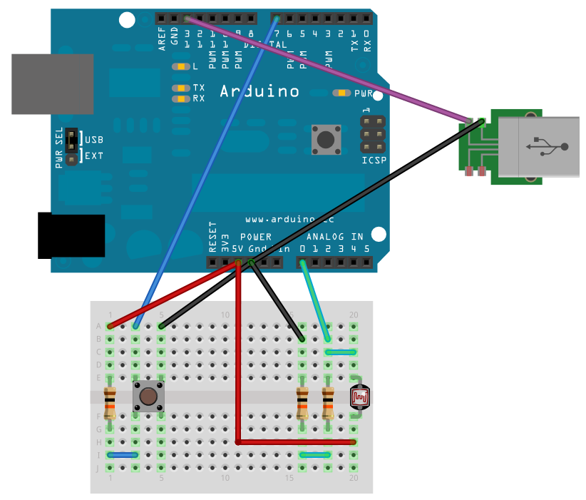
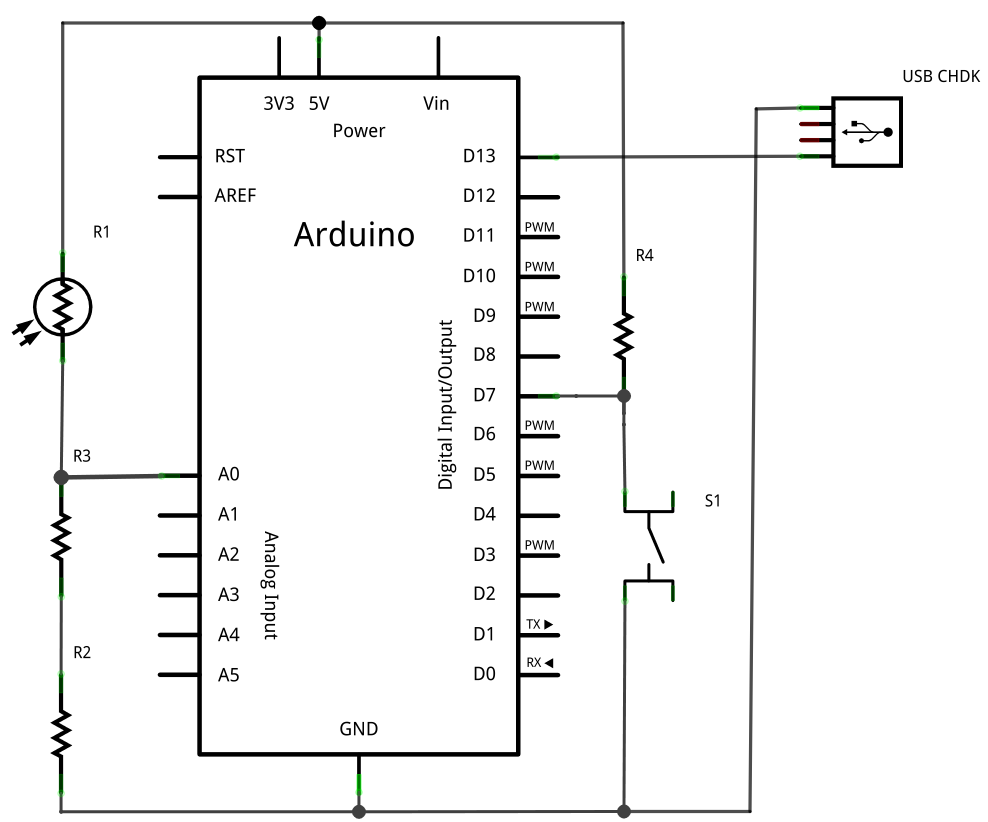

Disparador Láser USB
====================

Proyecto didáctico presentado en la platica [Open Hardware: Como usarlo
en proyectos de fotografía y
automatización](http://speakerdeck.com/manuelrabade/sensor-de-barrea-laser-para-disparar-una-canon-a480)
impartida en el [TelmexHub](http://www.telmexhub.com.mx/) el 7 de
diciembre de 2010.

El objetivo de este proyecto es implementar un sistema de barrera láser
con un [Arduino](http://arduino.cc) para disparar una cámara [Canon
A480](http://chdk.wikia.com/wiki/A480) con el firmware
[CHDK](http://chdk.wikia.com) por medio de su puerto USB.

Hardware
--------

### Placa de pruebas

### Esquemático

Firmware
--------

[firmware/arduino/CHDK/CHDK.pde](firmware/arduino/CHDK/CHDK.pde) -
Sketch para Arduino.

[firmware/chdk/arduino.bas](firmware/chdk/arduino.bas) - Script para
CHDK.

Autor
-----

Manuel Rábade <[manuel@rabade.net](mailto:manuel@rabade.net)>

Licencia
--------

Esta obra es publicada bajo una [licencia de Creative Commons
Reconocimiento-CompartirIgual 4.0
Internacional](http://creativecommons.org/licenses/by-sa/4.0/).
